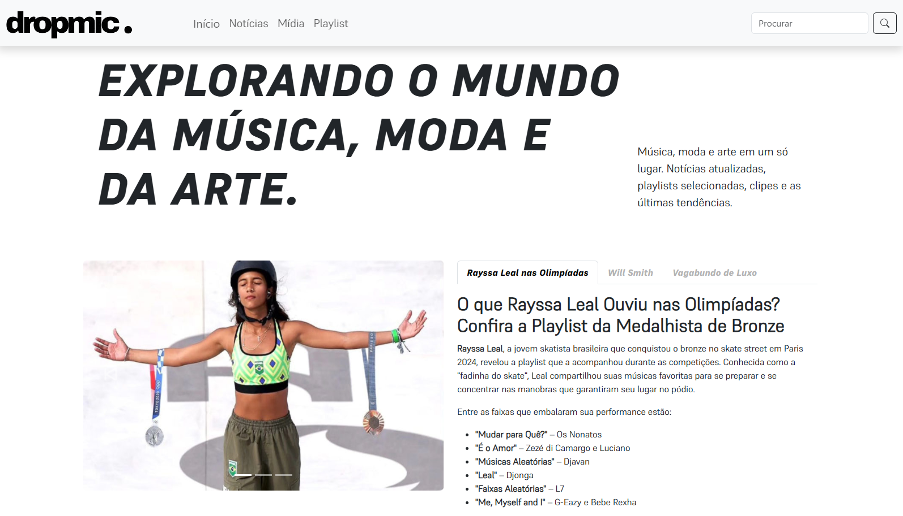
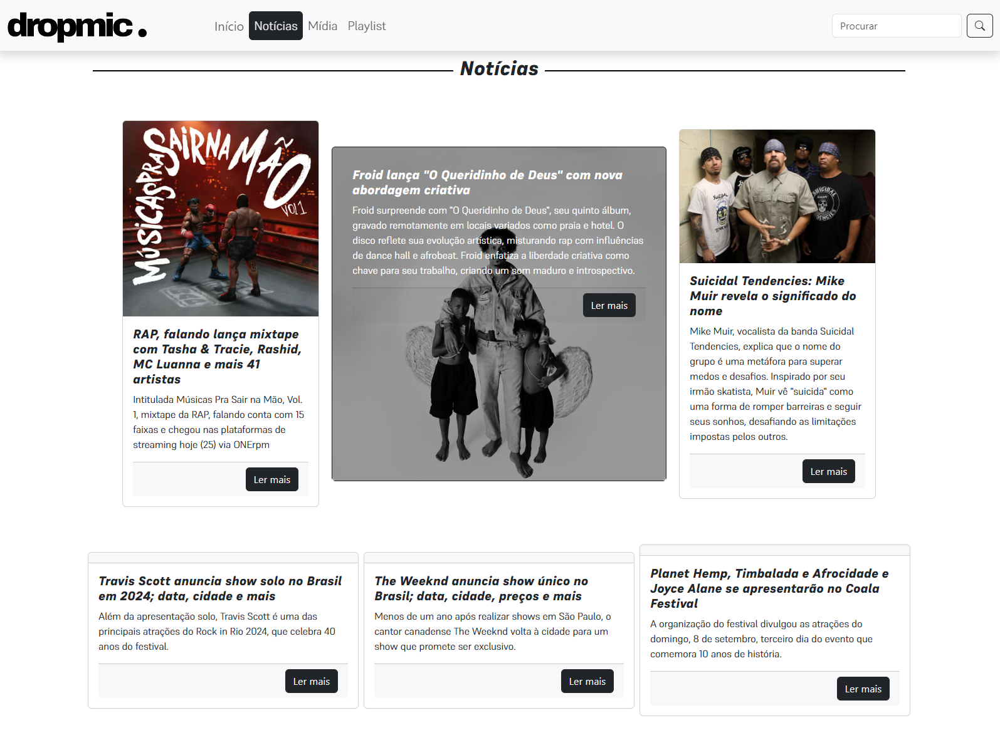
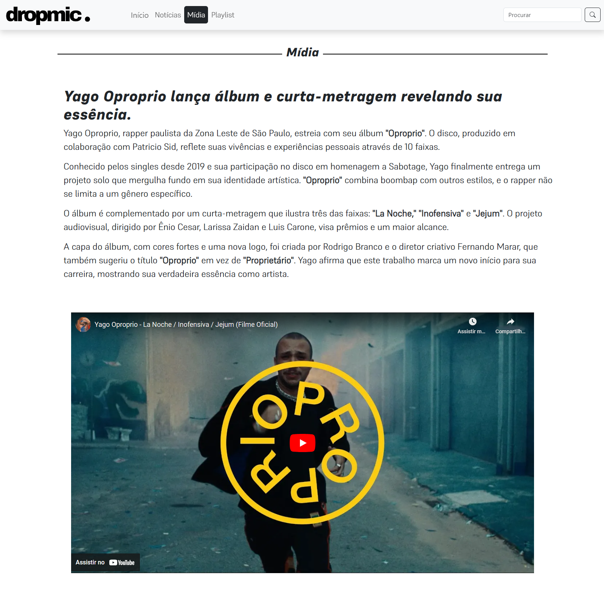
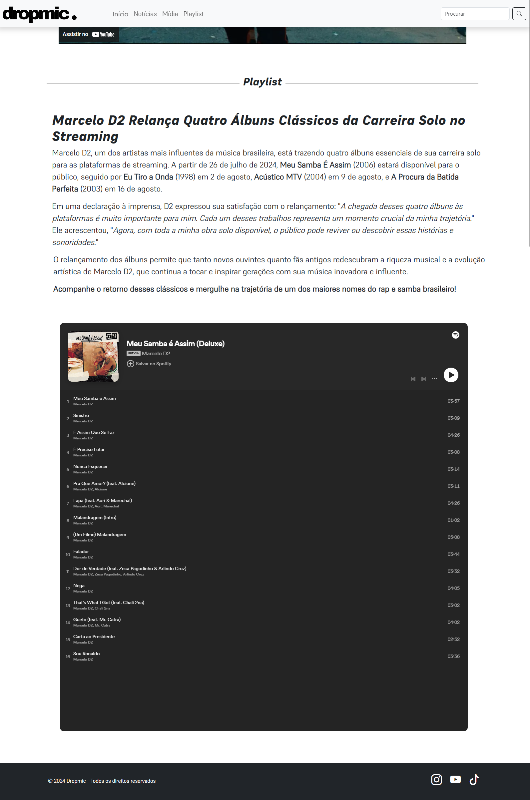

# Dropmic

## Visão Geral
Bem-vindo ao projeto do portal **Dropmic**, um site focado em notícias e matérias sobre o mundo da música, arte e moda. Nosso objetivo é criar uma experiência envolvente e visualmente atraente para os entusiastas dessas culturas.

## Funcionalidades Principais
### Início
A página inicial captura a essência do Dropmic com um carousel de destaque e uma introdução que apresenta as últimas notícias e tendências no mundo da música, arte e moda.

### Notícias
Nesta seção, você encontrará as notícias mais recentes sobre música, arte e moda, com um foco especial no universo do hip-hop e rap.

### Playlist
Oferecemos playlists recomendadas, incorporadas diretamente do Spotify, para que os visitantes possam curtir as músicas mais recentes e populares.

### Mídia
Nesta seção, apresentamos clipes em destaque e outras mídias relacionadas ao universo cultural abordado pelo Dropmic.

## Estrutura do Código
- **HTML5**: Estrutura semântica e acessível.
- **CSS3**: Estilos responsivos e modernos.
- **JavaScript**: Funcionalidades interativas e dinâmicas.
- **Bootstrap**: Framework utilizado para facilitar a criação de um design responsivo.

## Destaques Técnicos
### Design Responsivo
O site é completamente responsivo, garantindo uma experiência de usuário consistente em todos os dispositivos, desde desktops até smartphones.

### Menu Hamburguer
Implementação de um menu hambúrguer para navegação móvel, permitindo uma experiência de usuário intuitiva em dispositivos menores.

### Carousel
Utilização de um carousel para destacar as principais notícias e matérias, integrado com uma barra de navegação por abas para facilitar a navegação entre os conteúdos.

### Integração de Mídia
Incorporação de vídeos e playlists do Spotify usando iframes, garantindo que o conteúdo multimídia seja exibido corretamente e de forma responsiva.

## Capturas de Tela
### Início

### Notícias

### Mídia

### Playlist

## Autor
Desenvolvido por Rafael Barbosa, um desenvolvedor apaixonado por criar experiências web intuitivas e envolventes. Sinta-se à vontade para explorar o código e usar este projeto como uma referência para o seu próprio portfólio.
